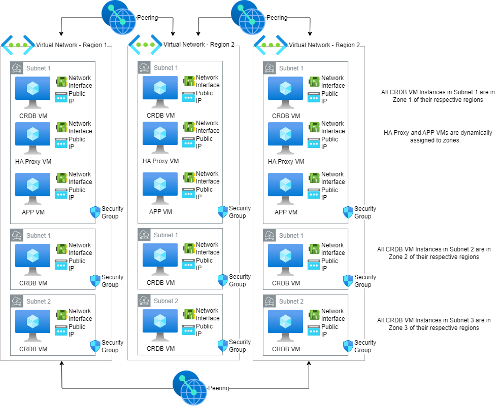
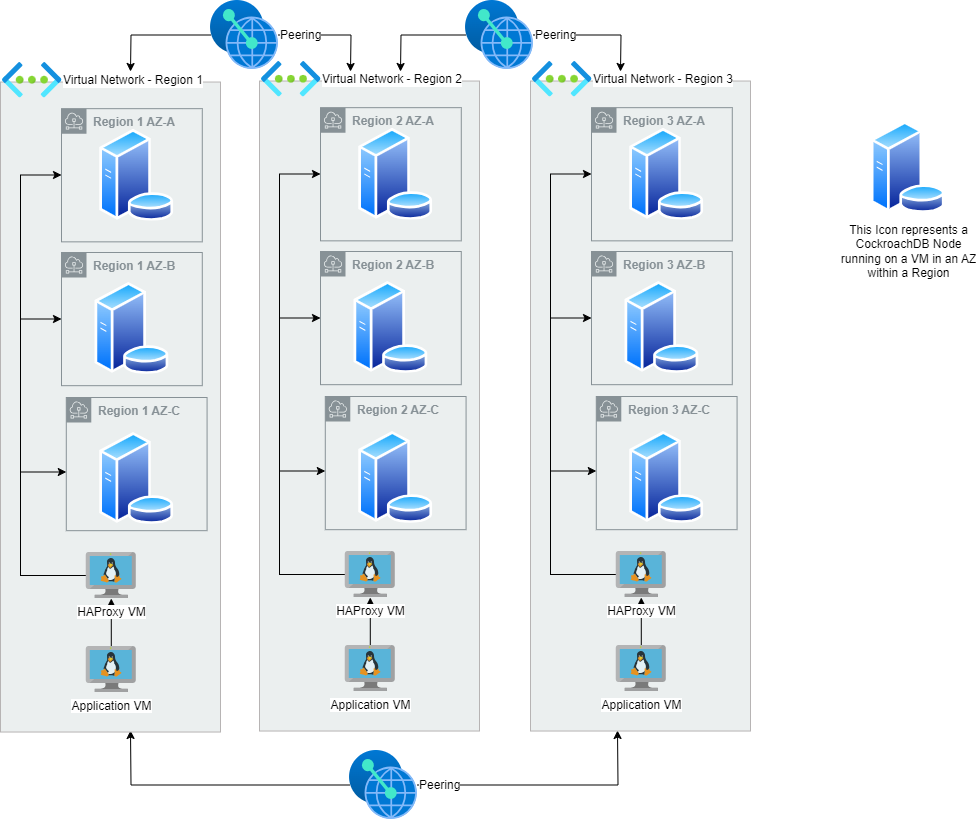

# Azure Multi-Region Cockroach Cluster





# TLDR;
Start by creating an SSH Key in Azure (region does not matter).  You'll supply the name of the key as a variable to the HCL (Hashicorp Configuration Language).   This key will allow you to log in to all the compute instances created by this script.

Export the following in the session where you will run the HCL.  An Enterprise license is required to run the CRDB Cluster in a multi-region configuration.
```
export TF_VAR_cluster_organization={CLUSTER ORG}
export TF_VAR_enterprise_license={LICENSE}
```

## Run this Terraform Script
```terraform
# See the appendix below to intall Terrafrom, the Azure CLI and logging in to Azure

git clone https://github.com/nollenr/AZURE-Terraform-CRDB-Multi-Region.git
cd AZURE-Terraform-CRDB-Multi-Region/

# if you intend to use enterprise features of the database 
export TF_VAR_cluster_organization={CLUSTER ORG}
export TF_VAR_enterprise_license={LICENSE}
```
### Modify the terraform.tfvars to meet your needs
You'll need to change several variable values to meet your needs.  For example, you may want different regions, Virtual Network CIDRs, etc.

```
terraform init
terraform plan
terraform apply

# To clean up
terraform destroy
```

It is important to understand that 15 instances will be created when this script is executed:
- 9 CRDB instances (3 nodes per region in 3 regions)
- 3 HA Proxy Nodes (1 HA Proxy per region)
- 3 APP Nodes (1 APP node per region)

# UA Architecture (for PCR) Not Supported in MR
Currently, UA Architecture (supported in single region) is not available in Multi-Region.

# For ARM Installs
- the version of CRDB must be 23.2.x and above

## terraform.tfvars and vars.tf
Be careful in choosing values for variables in the `teffaform.tfvars` and `vars.tf` files.  They must conform to Azure naming standards and be valid values for the types of objects being created.  No checking is performed on the inputs.

# Appendix

## Making Sense of the TLS Certs Used in This HCL
There are a lot of TLS objects (see [tls HCL file](tls.tf) ).  To help make sense of the objects and how they are used in CRDB and VM formation, I created this chart to help -- maybe it does, maybe it doesn't.  
| Variable | CRDB  Name| TLS | TLS Name | Note |
| ------   | ----      | --- | -------- | ---- |
| tls_private_key | ca.key | tls_private_key.crdb_ca_keys.private_key_pem | TLS Private Key PEM| |
|tls_public_key|ca.pub|tls_private_key.crdb_ca_keys.public_key_pem|TLS Public Key PEM| |
|tls_cert|ca.crt|tls_self_signed_cert.crdb_ca_cert.cert_pem|TLS Cert PEM| |
|tls_self_signed_cert|ca.crt|tls_self_signed_cert.crdb_ca_cert.cert_pem|TLS Cert PEM|Duplicate of tls_cert for better naming
|tls_user_cert|client.name.crt|tls_locally_signed_cert.user_cert.cert_pem| | | 
|tls_locally_signed_cert |client.name.crt |tls_locally_signed_cert.user_cert.cert_pem | | Duplicate of tls_user_cert for better naming
|tls_user_key|client.name.key|tls_private_key.client_keys.private_key_pem| | |

## Replacing an instance from a module

To replace the app instance from the first VPC (vpc 0)
```terraform apply -replace=module.crdb-region-0.azurerm_linux_virtual_machine.app[0]```


[def]: resources/azure-multi-regon-simple.drawio